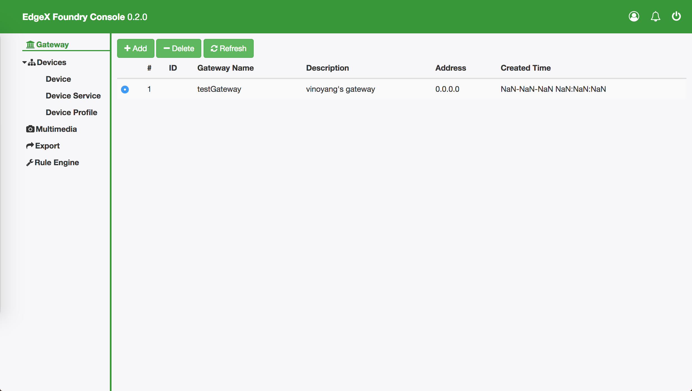

# edgex-ui-go
[](https://goreportcard.com/report/github.com/edgexfoundry-holding/edgex-ui-go) [](LICENSE)
> Go implementation of EdgeX Web UI.

<p align="center">
  
</p>

Effect picture after refactoring frontend ui (to be done):

<p align="center">
  
</p>

## Install and Deploy

To fetch the code and compile the web ui:

```
go get github.com/edgexfoundry-holding/edgex-ui-go
cd $GOPATH/src/github.com/edgexfoundry-holding/edgex-ui-go
glide install
make build
```

Or if you use git clone command:
```
cd $GOPATH/src
git clone http://github.com/edgexfoundry-holding/edgex-ui-go.git github.com/edgexfoundry-holding/edgex-ui-go
cd $GOPATH/src/github.com/edgexfoundry-holding/edgex-ui-go
glide install
make build
```

To rebuild if you changed the source code :

```
make clean
make build
```

To test the web ui :

```
make test
```

Before start running , you should go to deployments/initmongo.js to see how initialize your mongo DB instance, and config connect information under web/app/repository/mongo/mongo.go.
If not do this , the edgex-ui-go will use a default memory db.

To run the web ui :

```
make run
```

## How to login
In your browser , type: http://localhost:4000
The default user account information:

```
UserName     : admin
UserPassword : admin
```

## Integrate with edgex Go microservices

> prepare : make sure you have installed docker stable version.

The latest docker compose file for EdgeX California version (0.6.0) is in
[edgexfoundry/developer-scripts repository](https://github.com/edgexfoundry/developer-scripts/blob/master/compose-files/docker-compose-california-0.6.0.yml).

Download this docker compose file :

    wget https://github.com/edgexfoundry/developer-scripts/blob/master/compose-files/docker-compose-california-0.6.0.yml

Rename it to `docker-compose.yml`

    mv docker-compose-california-0.6.0.yml docker-compose.yml

Pull all the docker image about the EdgeX California go microservice in the same dir:

    docker-compose pull

Start the EdgeX Foundry file volume--must be done before the other services are started:

    docker-compose up -d volume

Pull config-seed:

    docker-compose up -d config-seed

Start the NoSQL MongoDB container:

    docker-compose up -d mongo

Start other microservice containers.

List all containers :

    docker ps -a

Start all edgex go microservice:

    docker-compose start

Stop all edgex go microservice:

    docker-compose stop

More detail about using edgex microservice with docker, please see [EdgeX Wiki - User guide](https://wiki.edgexfoundry.org/display/FA/Get+EdgeX+Foundry+-+Users)

## Community
- Chat: https://chat.edgexfoundry.org/home
- Mainling lists: https://lists.edgexfoundry.org/mailman/listinfo

## License
[Apache-2.0](LICENSE)
