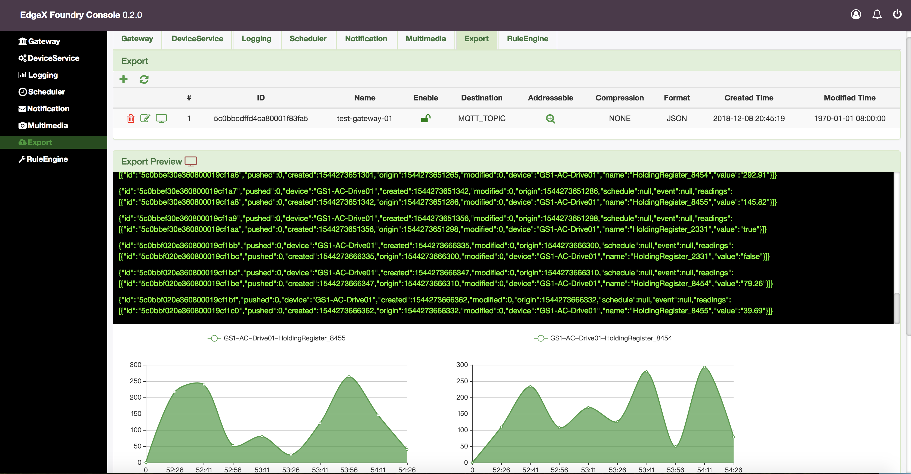

# edgex-ui-go
[](https://jenkins.edgexfoundry.org/view/EdgeX%20Foundry%20Project/job/edgexfoundry/job/edgex-ui-go/job/master/) [](https://codecov.io/gh/edgexfoundry/edgex-ui-go) [](https://goreportcard.com/report/github.com/edgexfoundry/edgex-ui-go) [](https://github.com/edgexfoundry/edgex-ui-go/tags)  [](https://choosealicense.com/licenses/apache-2.0/)  [](https://github.com/edgexfoundry/edgex-ui-go/pulls) [](https://github.com/edgexfoundry/edgex-ui-go/contributors) [](https://github.com/orgs/edgexfoundry/teams/edgex-ui-go-committers/members) [](https://github.com/edgexfoundry/edgex-ui-go/commits)


## Use and Purpose
The EdgeX UI is for **demonstration and developer use** to manage and monitor a single instance of EdgeX Foundry (unsecured).  Specifically, it can:
- Manage (add, remove, update) the EdgeX objects (device, device services, profiles, rules, app services, etc.)
- Monitor the EdgeX data flow (events and readings) and services
- Monitor and manage from on-box with EdgeX (on the same host)

As is, the EdgeX UI **is not meant for production use!**  Developers can use the UI as a base from which to create additional user interfaces.  The EdgeX community is also exploring production level use cases and extending/expanding the UI for future releases that would include more production level needs such as the ability to use the UI from on or off box.

> Go implementation of EdgeX Web UI.


<p align="center">
  
</p>

## User guide and operation video

- If you want to learn how to use the UI, you can refer to the user guide [user guide](https://github.com/edgexfoundry/edgex-ui-go/blob/master/docs/UseGuide.md).

- EdgeX UI operation video : [youtube](https://www.youtube.com/watch?v=FuR1g64BDE8) . [youku](https://v.youku.com/v_show/id_XNDY5NzExNjcyNA==.html).

- [Add MQTT Device to EdgeX](./docs/ExamplesAddingMQTTDevice/AddMQTTDeviceToEdgeX.md)

- [EdgeX Documentation](https://wiki.edgexfoundry.org/display/FA/EdgeX+Documentation)

## Install and Deploy

To fetch the code and compile the web-based UI:

Using `go get`:
```
go get github.com/edgexfoundry/edgex-ui-go
cd $GOPATH/src/github.com/edgexfoundry/edgex-ui-go
make build
```

Using Git:
```
cd $GOPATH/src
git clone http://github.com/edgexfoundry/edgex-ui-go.git github.com/edgexfoundry/edgex-ui-go
cd $GOPATH/src/github.com/edgexfoundry/edgex-ui-go
make build
```

To start the application and the web-based UI:

```
make run
```

To rebuild after making changes to source:

```
make clean
make build
```

To test the web-based UI:

```
make test
```
To start all the EdgeX Go microservices in Docker, run the following command in the root of the EdgeX Go directory:

```
make run_docker
```

With a modern browser, navigate to http://yourdomain:4000 (change *yourdomain* to your server's hostname or ip). 
> NOTE: make sure that EdgeXFoundry is already running, Please refer to [Edgex Services Get Started](https://github.com/edgexfoundry/edgex-go/blob/master/README.md). 

> NOTE: if you want remote access the UI, you shuold remove the UI network in docker-compose.yml, this way you can allow the UI to live someplace else and have access to EdgeX through Kong.

If you want to run edgex-ui-go with docker-compose yml file, you can reference three ways:

> 1: For example [docker-compose-hanoi-ui](https://github.com/edgexfoundry/developer-scripts/blob/master/releases/hanoi/compose-files/docker-compose-hanoi-ui.yml), you can change 'networks' to the same as [docker-compose-hanoi](https://github.com/edgexfoundry/developer-scripts/blob/master/releases/hanoi/compose-files/docker-compose-hanoi.yml), and run 'docker-compose -f docker-compose-hanoi-ui.yml up -d', then the UI will connect with EdgeX Server.
 
> 2: You can use the make file commands ‘make run arm64’ and ‘make run-ui arm64’ to run the Edgex Stack and UI as it uses the ‘-p edgex’ option required for the networking to link properly. 

> 3: If not running from the cloned developer-scripts, you can also do this directly with ‘docker-compose -p edgex -f docker-compose-hanoi-arm64.yml up -d’ and ‘docker-compose -p edgex -f docker-compose-hanoi-ui-arm64.yml up -d’.

## Community
- EdgeXFoundry Chinese Club: https://www.edgexfoundry.club
- Chat: https://chat.edgexfoundry.org/home
- Mainling lists: https://lists.edgexfoundry.org/mailman/listinfo

## License
[Apache-2.0](LICENSE)

## Feedback

- If you want to learn how to use the UI, you can refer to the user guide [user guide](https://github.com/edgexfoundry/edgex-ui-go/blob/master/docs/UseGuide.md).

- If you find a bug or want to request a new feature, please open a [GitHub Issue](https://github.com/edgexfoundry/edgex-ui-go/issues).

- Have a online chat at the appointed time on the [zoom](https://VMware.zoom.us/j/3697467292).

  **Note** Please contact to us before you want to have a online chat.
