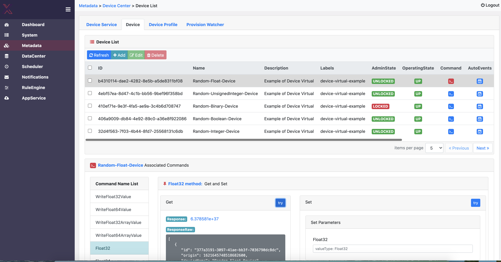

# edgex-ui-go
[](https://jenkins.edgexfoundry.org/view/EdgeX%20Foundry%20Project/job/edgexfoundry/job/edgex-ui-go/job/main/) [](https://codecov.io/gh/edgexfoundry/edgex-ui-go) [](https://goreportcard.com/report/github.com/edgexfoundry/edgex-ui-go) [](https://github.com/edgexfoundry/edgex-ui-go/tags)  [](https://choosealicense.com/licenses/apache-2.0/)  [](https://github.com/edgexfoundry/edgex-ui-go/pulls) [](https://github.com/edgexfoundry/edgex-ui-go/contributors) [](https://github.com/orgs/edgexfoundry/teams/edgex-ui-go-committers/members) [](https://github.com/edgexfoundry/edgex-ui-go/commits)


## Use and Purpose
The EdgeX UI is for **demonstration and developer use** to manage and monitor a single instance of EdgeX Foundry (unsecured).  Specifically, it can:
- Manage (add, remove, update) the EdgeX objects (device, device services, profiles, rules, app services, etc.)
- Monitor the EdgeX data flow (events and readings) and services
- Monitor and manage from on-box with EdgeX (on the same host)

As is, the EdgeX UI **is not meant for production use!**  Developers can use the UI as a base from which to create additional user interfaces.  The EdgeX community is also exploring production level use cases and extending/expanding the UI for future releases that would include more production level needs such as the ability to use the UI from on or off box.

> Go implementation of EdgeX Web UI.


<p align="center">
  
</p>

## Install and Deploy

* Make sure you're using at least Go 1.12 (UI backend server currently uses Go 1.16.x)
* If your code is in your GOPATH then make sure ```GO111MODULE=on``` is set
* Run ```go mod tidy```
    * This will add the all dependent libraries to the go.mod file and download it into the module cache

```
git clone http://github.com/edgexfoundry/edgex-ui-go.git
cd edgex-ui-go
make build
```

To start the application and the web-based UI:

```
make run
```

To rebuild after making changes to source:

```
make clean
make build
```

To test the web-based UI:

```
make test
```
## Other installation and deployment options

### Docker

To start all the EdgeX Go microservices in Docker, run the following command in the root of the EdgeX Go directory:

```
make docker run_docker
```

With a modern browser, navigate to http://yourdomain:4000 (change *yourdomain* to your server's hostname or ip). 
> NOTE: make sure that EdgeXFoundry is already running, Please refer to [Edgex Services Get Started](https://github.com/edgexfoundry/edgex-go/blob/main/README.md). 

### Snap 

EdgeX UI is also available as a snap package. For more details on the snap, including how to install it, please refer to [EdgeX UI Snap](https://github.com/edgexfoundry/edgex-ui-go/tree/main/snap/README.md)

## Community
- [EdgeXFoundry Chinese Club](https://www.edgexfoundry.club)
- [EdgeXFoundry Slack #edgex-ui channel](https://slack.edgexfoundry.org/)
- [Mailing lists](https://lists.edgexfoundry.org/g/main)

## License
[Apache-2.0](LICENSE)

## Feedback

- If you want to learn how to use the UI, you can refer to the user guide [user guide](https://docs.edgexfoundry.org/2.1/getting-started/tools/Ch-GUI/).

- If you find a bug or want to request a new feature, please open a [GitHub Issue](https://github.com/edgexfoundry/edgex-ui-go/issues).
