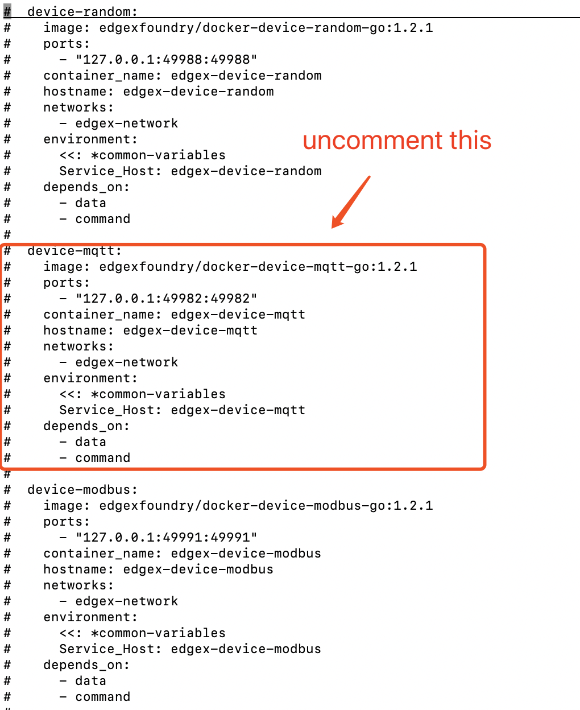
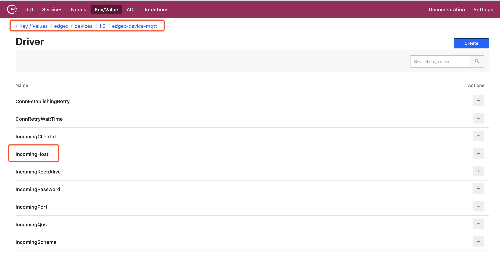
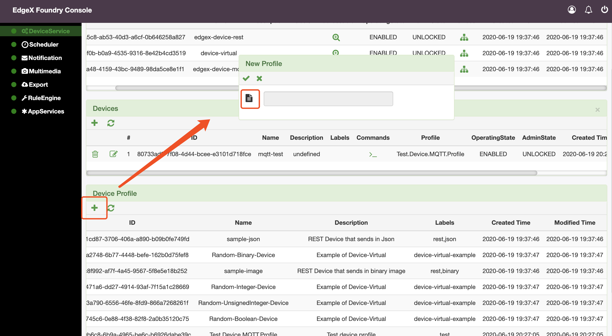
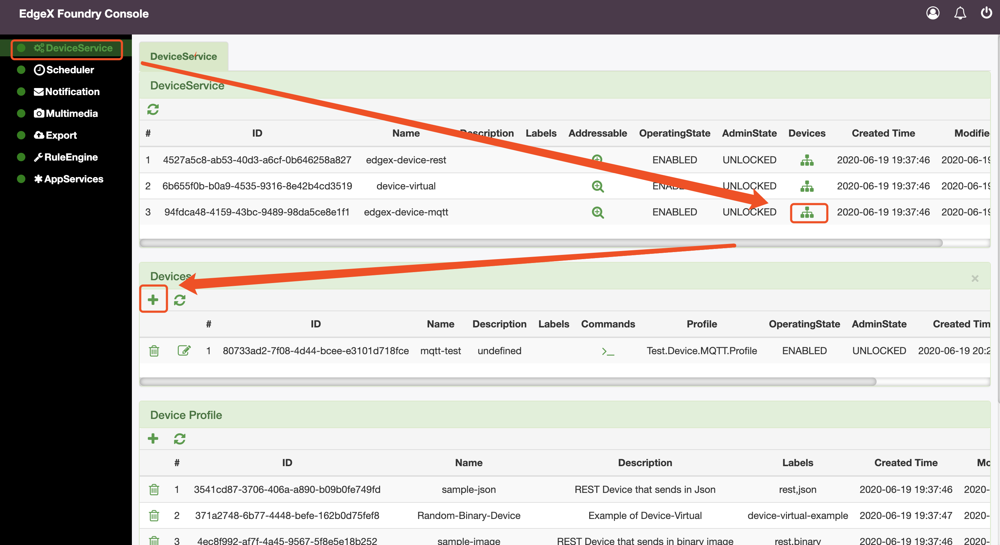
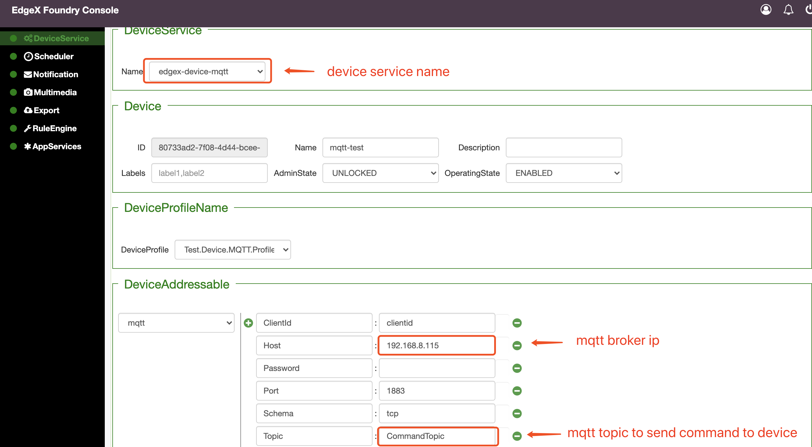
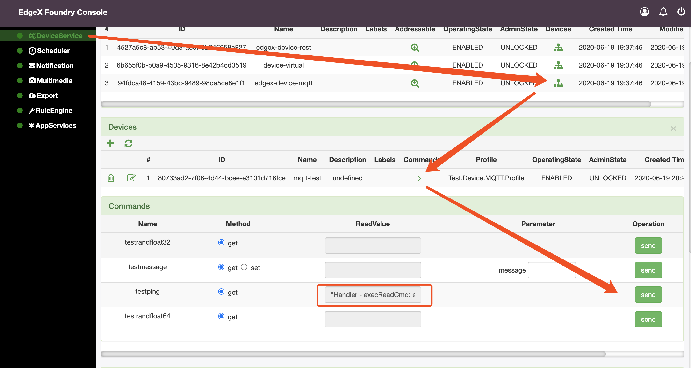
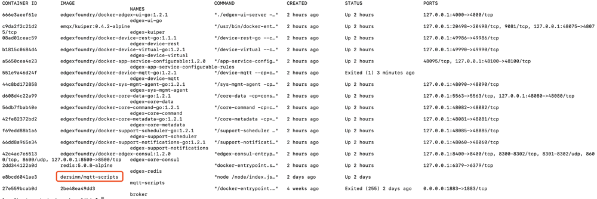
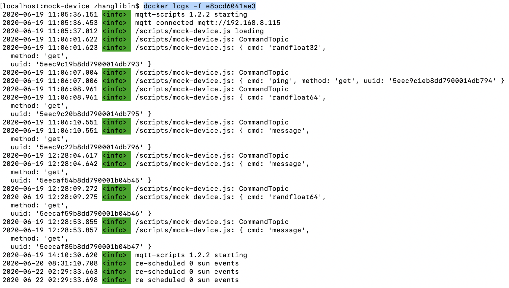

# Adding MQTT Device

## 1.  Setup an MQTT Broker

If you have already an mqtt broker installed on your machine, skip this step.
```bash
$ docker run -d --name broker -p 1883:1883 eclipse-mosquitto
```

## 2. Setup EdgeX

Using the [Geneva](https://github.com/edgexfoundry/developer-scripts/blob/master/releases/geneva/compose-files/docker-compose-geneva-redis-no-secty.yml) docker version, Uncomment the device mqtt code in the docker compose file, then start edgex (at this time, the default configuration of edgx-device-mqtt  can't work. It needs to use EdgeX consul  to dynamically modify the configuration of edgex-device-mqtt)

- Uncomment device-mqtt code



- Start EdgeX

EdgeX docker compose file with no-secty suffix does not enable Edgex security components(EdgeX kong gateway).

```
 docker-compose -f docker-compose-geneva-redis-no-secty.yml up -d
 docker-compose -f docker-compose-geneva-ui.yml up -d
```

## 3. Modify device-mqtt Driver Configuration

- With a modern browser, navigate to http://yourhostip:8500 (EdgeX consul UI), Go to Key / Values > edgex > devices > 1.0 > edgex-device-mqtt > Driver page. 



- Modify 0.0.0.0 of incominghost and responsehost to yourhostip. 

- Restart the edgex-device-mqtt docker container.

## 4. Register a New MQTT Device to EdgeX

- Login in EdgeX UI(http://yourhostip:4000), navigate to DeviceService page -> Device Profile.

- Upload mqtt device profile.

   [mqtt.test.device.profile.yml](mqtt/mqtt.test.device.profile.yml)



- Add Device

Navigate to DeviceService page -> Devices,click "+" button.



Select or input required paramters.


## 5. Create a mock device to simulate a real device.

Use following script to simulate the MQTT device.

This simulator has three behaviors:

1. Publish random number data every 15 seconds
2. Receive the reading request, then return the response
3. Receive the put request, then change the device value

```javascript
// mock-device.js
function getRandomFloat(min, max) {
    return Math.random() * (max - min) + min;
}

const deviceName = "MQ_DEVICE";
let message = "test-message";

// 1. Publish random number every 15 seconds
schedule('*/59 * * * * *', ()=>{
    let body = {
        "name": deviceName,
        "cmd": "randfloat32",
        "randfloat32": getRandomFloat(25,29).toFixed(1)
    };
    publish( 'DataTopic', JSON.stringify(body));
});

// 2. Receive the reading request, then return the response
// 3. Receive the put request, then change the device value
subscribe( "CommandTopic" , (topic, val) => {
    console.log(topic);
    console.log(val);
    var data = val;
    if (data.method == "set") {
        message = data[data.cmd]
    }else{
        switch(data.cmd) {
            case "ping":
              data.ping = "pong";
              break;
            case "message":
              data.message = message;
              break;
            case "randfloat32":
                data.randfloat32 = getRandomFloat(25,29).toFixed(1);
                break;
        case "randfloat64":
                data.randfloat64 = getRandomFloat(10,1).toFixed(5);                                                                                                                                         
                break;
          }
    }
    publish( "ResponseTopic", JSON.stringify(data));
});                                                                                                                                                                                                   
```

To run the device simulator, enter the commands shown below with the following changes:

1. Replace the /path/to/mqtt-scripts in the example mv command with the correct path
2. Replace the mqtt-broker-ip in the example docker run command with the correct broker IP:

```
mv mock-device.js /path/to/mqtt-scripts
docker run -d --restart=always --name=mqtt-scripts \
  -v /path/to/mqtt-scripts:/scripts  \
  dersimn/mqtt-scripts --url mqtt://mqtt-broker-ip --dir /scripts
```

## 6.  Test MQTT Device

Navigate to Deviceservice page  -> Devices -> (edgex-device-mqtt)  -> Devices -> Commands, choose a command,then click "send" button.



You can check mqtt-scripts docker logs, it will print received commands.




