# edgex-ui-go Use Guide
> The guide can help you learn how to use EdgeX Web UI.

 

## Create User and login

If this is your first deploy and open EdgeX UI, you will automatically jump to the user creation page :

  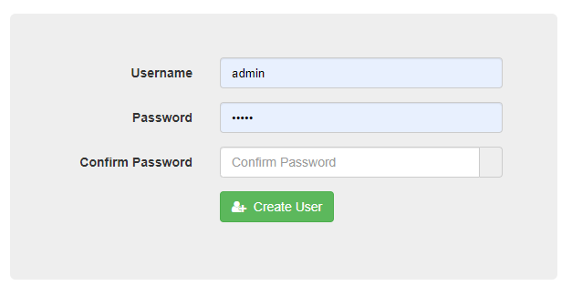

Create User:
Input `Username` , `Password` and `Confirm Password` , click `create user` to create an account.

Login :

  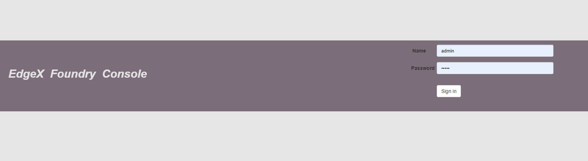

Input `Username` , `Password` , click `Sign in` to login EdgeX UI.

## Device Service
Device service can manage all your device services and devices :

  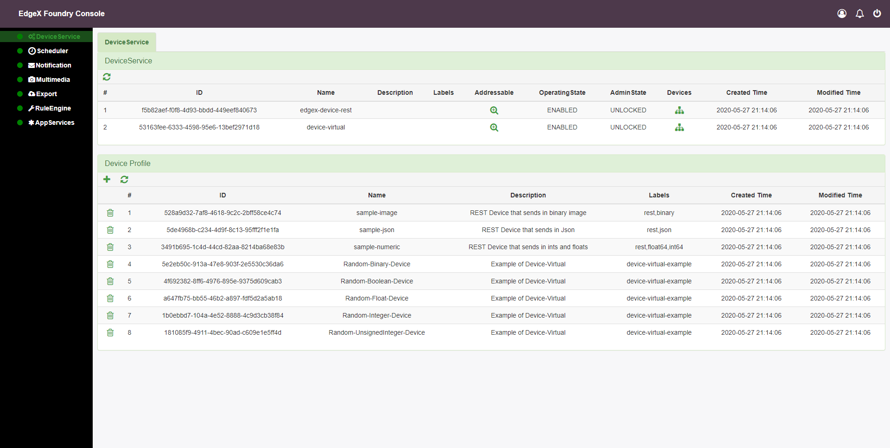

In the first table DeviceService,all device services are listed:

- `Addressable` button can show some information about this device service:

  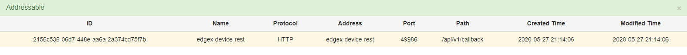

- `Devices` button lists all devices, you can manage devices:

  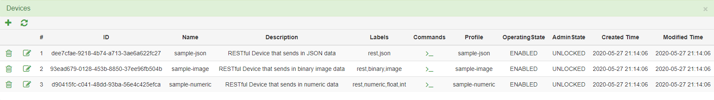

In Devices table , 
- `Commands` button can send commands to the device.

The second table Device Profile , you can use `profile.yml` to create or remove Device Profile:

  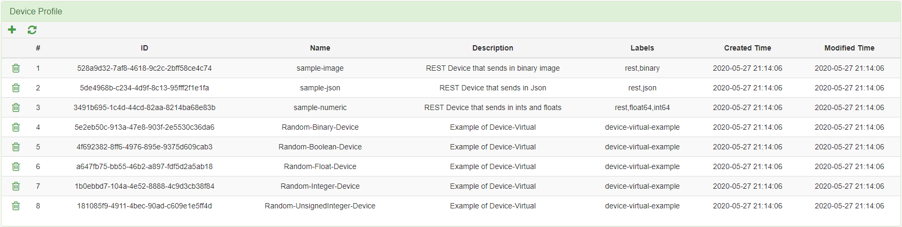

## Scheduler

Scheduler can manage all Intervals.

  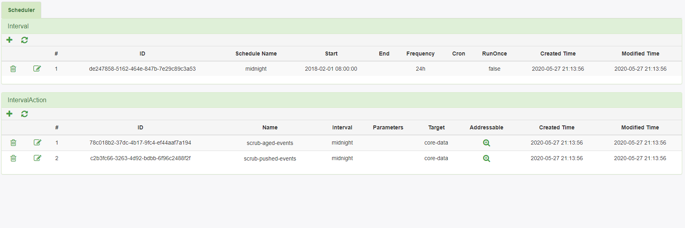

In the Interval table:
- `+`  to add a new interval, you can decide start time, end time, execute once or not, frequency and cron:

  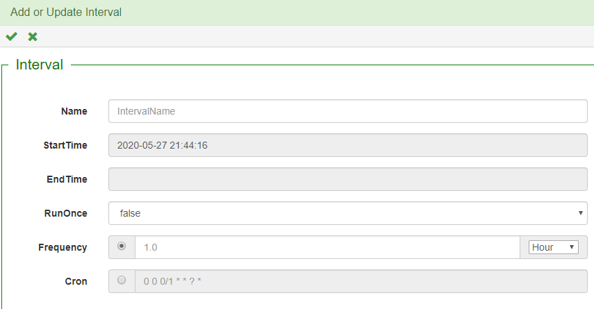

> NOTE: When you create a new interval, you should create actions in this interval.

IntervalAction table:

- `+`  to add actions in your selected interval:

  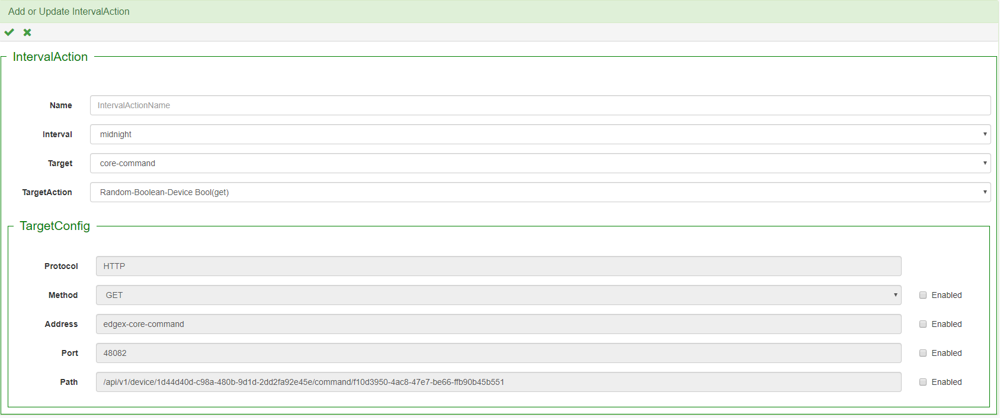

- `Addressable`  can show method and url in this action:

  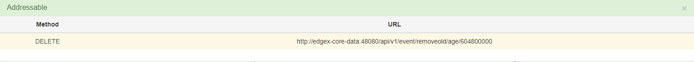

## Notification

Notification to manage notifications, to view transmissions, or custom subscription to receive notifications or logs:

  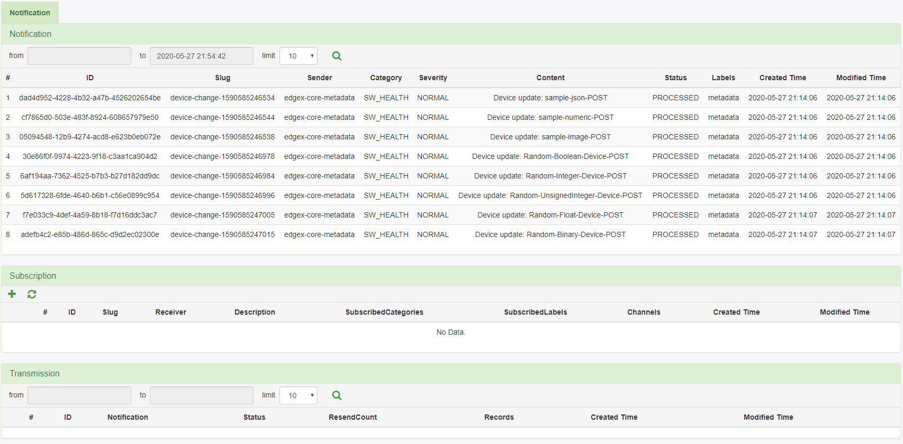

In Subscription table:

- `+`  to add a new subscription, you can config multiple channels:

  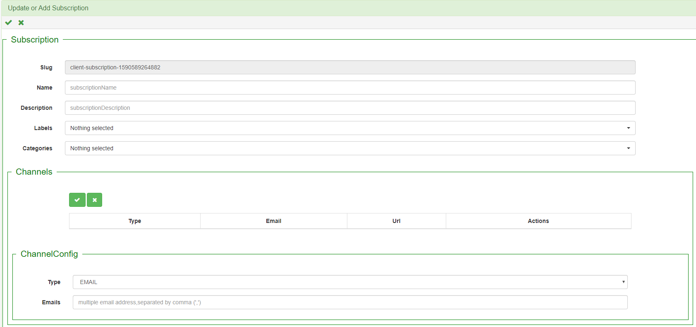

## AppService

In this page, you can manage multiple application Services:

  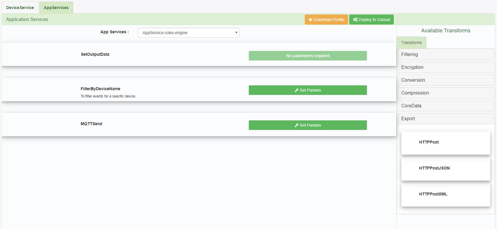

> NOTE: When you select one of the app services, left side of page can load all the methods of the current app service.

On the right side of the page, lists all currently supported methods, you can drag to the left, then set method parameters.

  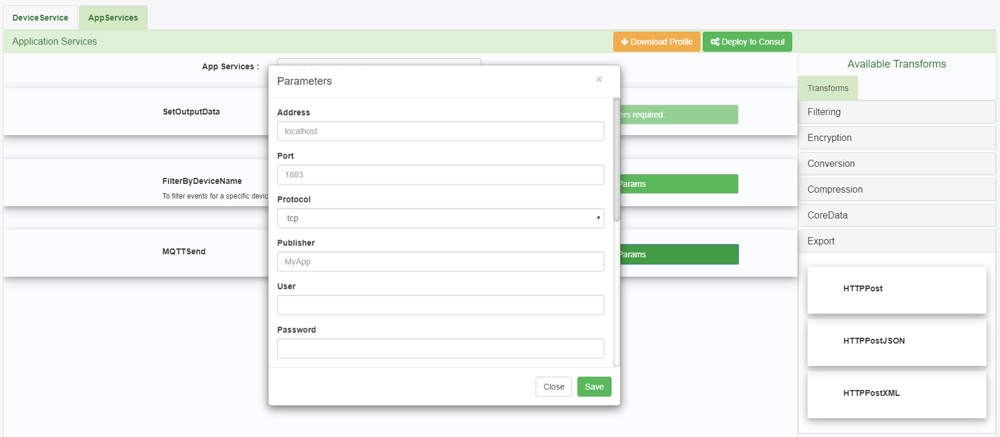

- `Download Profile` click this button to download currently configuration file in you selected app service.

- `Deploy to Consul` button can deploy you custom app service configuration to edgeXFoundry.

## Community
- EdgeXFoundry Chinese Club: https://www.edgexfoundry.club
- Chat: https://chat.edgexfoundry.org/home
- Mainling lists: https://lists.edgexfoundry.org/mailman/listinfo

## License
[Apache-2.0](LICENSE)

## Feedback

- If you find a bug or want to request a new feature, please open a [GitHub Issue](https://github.com/edgexfoundry/edgex-ui-go/issues).

- Have a online chat at the appointed time on the [zoom](https://VMware.zoom.us/j/3697467292).

  **Note** Please contact to us before you want to have a online chat.
