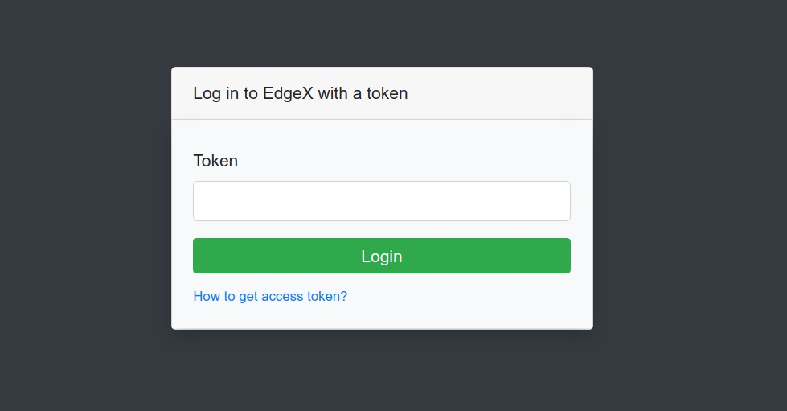
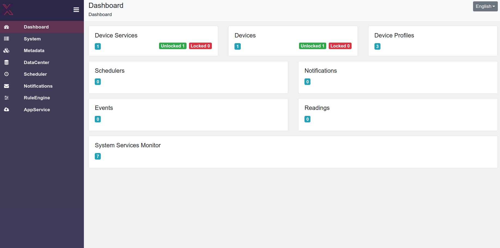

# EdgeX UI Snap
[](https://snapcraft.io/edgex-ui)

This folder contains snap packaging for the EdgeX UI Snap

The project maintains a rolling release of the snap on the `edge` channel that is rebuilt and published at least once daily

The snap currently supports the following architectures: `amd64`, `arm64`

## Installation

### Installing snapd

The snap can be installed on any system that supports snaps. You can see how to install snaps on your system [here](https://snapcraft.io/docs/installing-snapd)

However for full security confinement, the snap should be installed on an Ubuntu 18.04 LTS or later (Desktop or Server), or a system running Ubuntu Core 18 or later

### Installing EdgeX UI as a snap
The snap is published in the snap store at https://snapcraft.io/edgex-ui.
You can see the current revisions available for your machine's architecture by running the command:

```bash
$ sudo snap info edgex-ui
```

The latest stable version of the snap can be installed using:

```bash
$ sudo snap install edgex-ui
```

A specific release of the snap can be installed from a dedicated channel. For example, to install the 2.1 (Jakarta) release:

```bash
$ sudo snap install edgex-ui --channel=2.1
```

The latest development version of the edgex-ui snap can be installed using:

```bash
$ sudo snap install edgex-ui --edge
```

**Note** - in general, installing from the edge channel is only recommended for development purposes

**Note** - the snap has only been tested on Ubuntu Desktop

### Install and configure dependencies
EdgeX UI depends on several other edgexfoundry services. 

Please refer to [edgexfoundry Snap](https://github.com/edgexfoundry/edgex-go/blob/main/snap/README.md) for installation of the snapped version.

After these steps, edgex-ui snap and edgexfoundry services will be running as follows:

```bash
$ sudo snap services
Service                                    Startup   Current   Notes
edgex-ui.edgex-ui                          enabled   active    -
edgexfoundry.app-service-configurable      disabled  inactive  -
edgexfoundry.consul                        enabled   active    -
edgexfoundry.core-command                  enabled   active    -
edgexfoundry.core-data                     enabled   active    -
edgexfoundry.core-metadata                 enabled   active    -
edgexfoundry.device-virtual                disabled  inactive  -
edgexfoundry.kong-daemon                   enabled   active    -
edgexfoundry.kuiper                        disabled  inactive  -
edgexfoundry.postgres                      enabled   active    -
edgexfoundry.redis                         enabled   active    -
edgexfoundry.security-bootstrapper-redis   enabled   inactive  -
edgexfoundry.security-consul-bootstrapper  enabled   inactive  -
edgexfoundry.security-proxy-setup          enabled   inactive  -
edgexfoundry.security-secretstore-setup    enabled   inactive  -
edgexfoundry.support-notifications         disabled  inactive  -
edgexfoundry.support-scheduler             disabled  inactive  -
edgexfoundry.sys-mgmt-agent                disabled  inactive  -
edgexfoundry.vault                         enabled   active    -
```

Some dependency services don't start by default. We need to start them if they are not already active.

Enable the following four services to avoid runtime errors (see issue [#472](https://github.com/edgexfoundry/edgex-ui-go/issues/472)):

```bash
$ sudo snap set edgexfoundry support-scheduler=on 
$ sudo snap set edgexfoundry support-notifications=on 
$ sudo snap set edgexfoundry sys-mgmt-agent=on
$ sudo snap set edgexfoundry kuiper=on
```

### JWT token

A JWT Token is required to access the UI securely through the API Gateway. To generate a JWT token, please refer to [these instructions](https://github.com/edgexfoundry/edgex-go/blob/main/snap/README.md#jwt-tokens).

Please keep the token in a safe place for future re-use as the same token cannot be regenerated or recovered from EdgeX's secret-config CLI. The token is required each time you reopen the web page.

### Using the edgex-ui snap

Open your browser [http://localhost:4000](http://localhost:4000/):
Please log in to EdgeX with the JWT token we generated above:



**Note** - please do not enter any space or special characters when defining names in the UI. You may use camelCase or any other convention of your liking.

For more detail on how to use each section of the UI, please see [here](https://docs.edgexfoundry.org/2.1/getting-started/tools/Ch-GUI/#general)

##### Snap management

The service can be stopped as follows. The `--disable` option
ensures that as well as stopping the service now, it will not be automatically started on boot:

```bash
$ sudo snap stop --disable edgex-ui.edgex-ui
```

The service can then be started as follows. The `--enable` option
ensures that as well as starting the service now, it will be automatically started on boot:

```bash
$ sudo snap start --enable edgex-ui.edgex-ui
```

##### Viewing logs

To view the logs for the service in the edgex-ui snap:

```
$ sudo snap logs edgex-ui.edgex-ui
```

